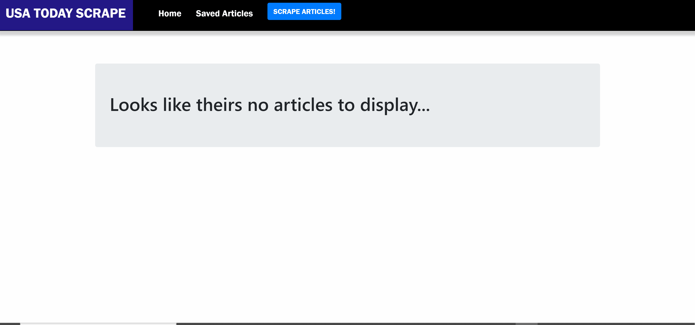

# USA TODAY Web-Scraper

## Overview
An app that scrapes articles from the USA TODAY website and lets users save articles and leave comments on the latest news.

## How It Works
- Scrape articles by clicking the "Scrape Articles" button.
- Once articles are loaded, read full article by clicking the heading or description text and save articles by clicking the "Save Article" button.
- Saved articles can be viewed at the "Saved Articles" page.
- Comments can be added on saved articles by clicking the "Comment" button.
- Saved articles can be deleted by clicking the "Delete" button.

## Technologies Used
- Node.js
- Bootstrap
- Express.js
- Handlebars.js
- MongoDB
- Mongoose
- npm packages
    - body-parser
    - express
    - express-handlebars
    - mongoose
    - cheerio
    - request
